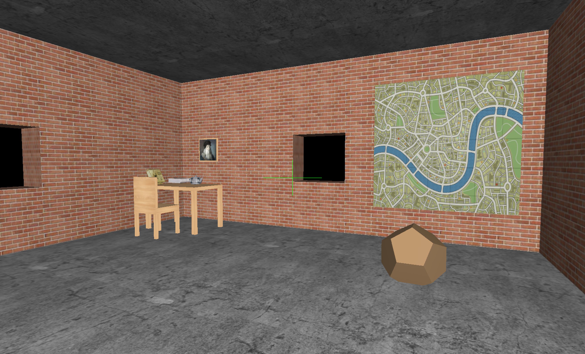
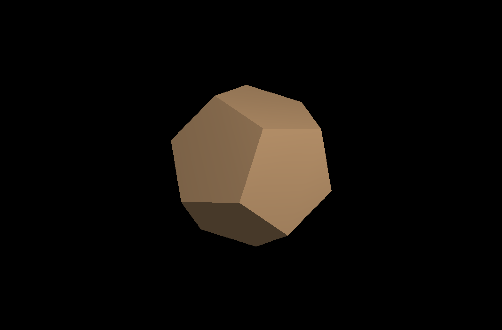
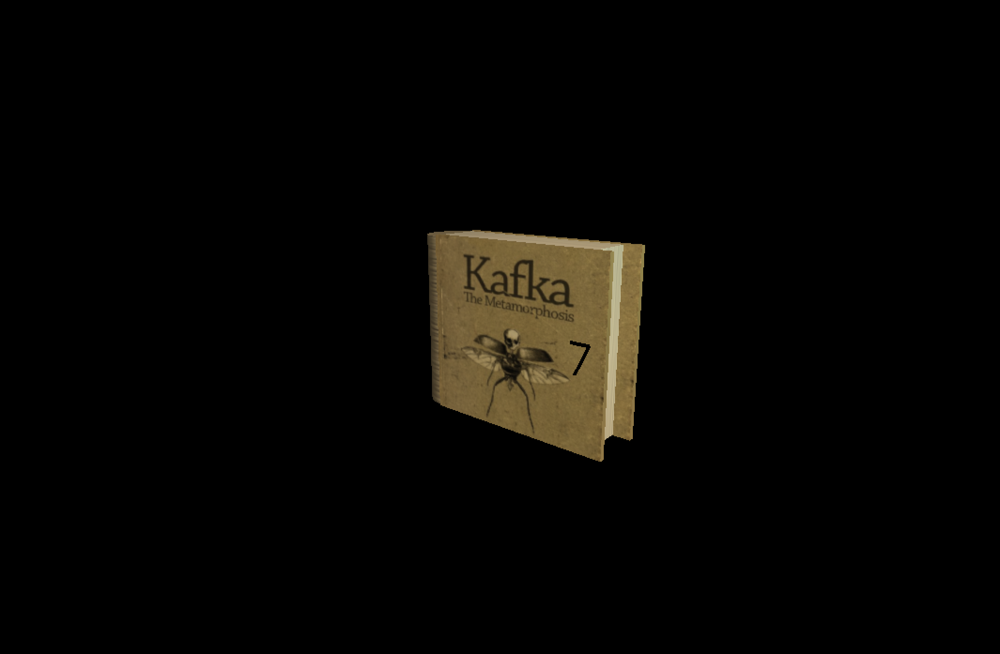
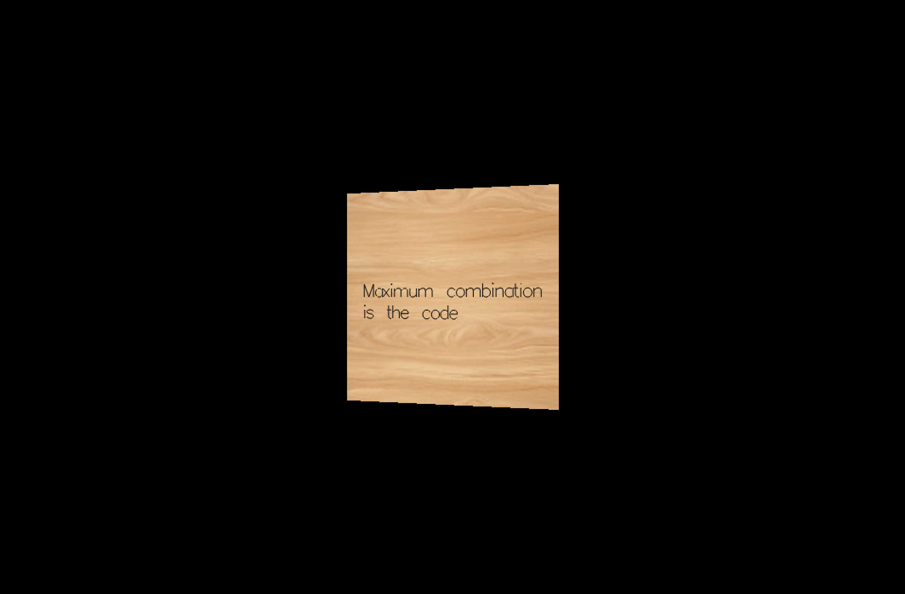
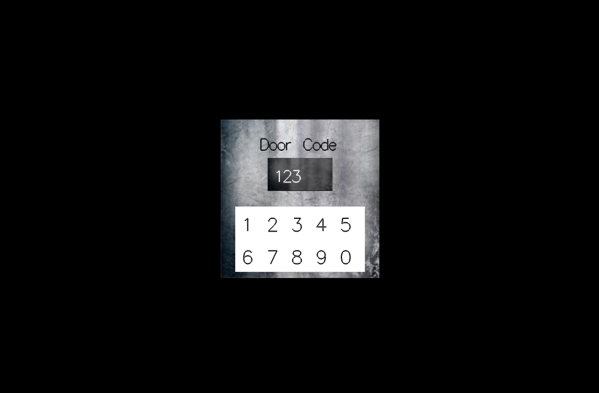
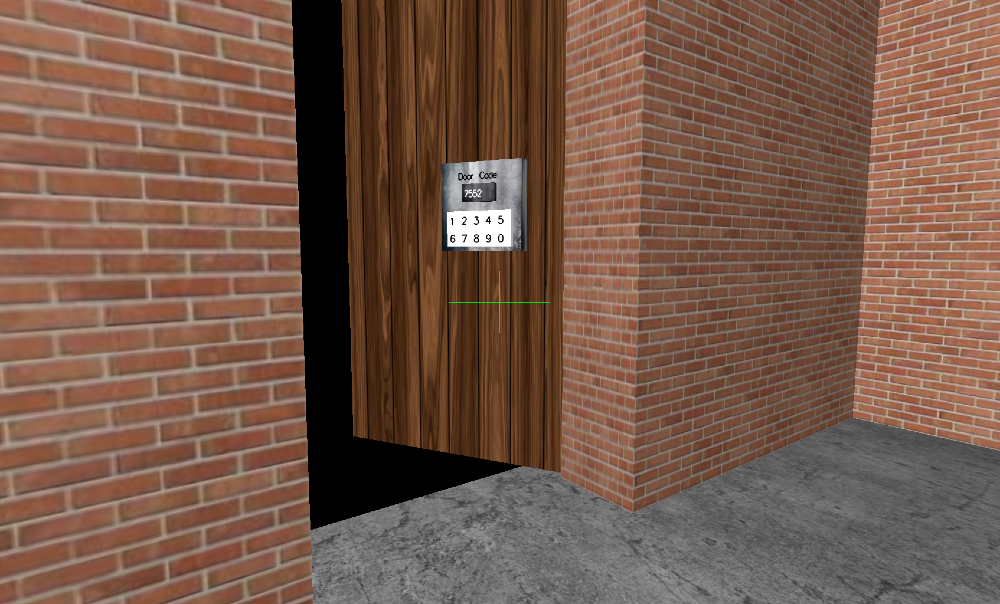

# 3D OpenGL Escape Room

A first-person 3D puzzle game developed using OpenGL and C++. The objective is to explore a detailed room, search for hidden clues, and discover the correct code to unlock the door and escape.

## Project Overview

This project demonstrates the implementation of a 3D environment with interactive elements, utilizing the OpenGL graphics pipeline. It features a first-person perspective, real-time lighting, and a dedicated object inspection system that allows players to rotate and examine clues.

### Key Features

#### 1. First-Person Exploration
- **Movement**: Full positional movement through the room using keyboard arrow keys.
- **Camera Control**: Fluid yaw and pitch rotation controlled by mouse movement to simulate a realistic first-person perspective.

#### 2. Object Inspection System
- **Interaction**: Players can interact with various objects in the room (e.g., books, frames, furniture) by clicking on them.
- **3D Examination**: Upon selecting an object, the game transitions to a dedicated inspection mode.
- **Rotation & Discovery**: Players can rotate the inspected object along the X, Y, and Z axes to uncover hidden numbers or clues placed on different surfaces.

#### 3. Puzzle Mechanics
- **Clue Hunting**: Numbers required for the escape code are hidden across multiple 3D objects.
- **Door Lock System**: A functional numeric keypad allows players to input the discovered code. Entering the correct combination triggers the door unlocking animation.

#### 4. Visuals & Environment
- **Detailed Texturing**: Use of various textures including wood, brick, concrete, and metal to create an immersive atmosphere.
- **Dynamic Lighting**: An implemented lighting system with a primary light source and ambient light to enhance depth and realism.
- **Custom Geometry**: Implementation of complex 3D shapes including cylinders, dodecahedrons, and a teapot.
- **Smooth Rendering**: Integration of line smoothing and multisampling to ensure high-quality text and edge rendering.

## Gameplay Demonstration

<div align="center">
  <video src="assets/recording/3D Escape Room Game.mp4" width="640" controls>
    Your browser does not support the video tag.
  </video>
  <br>
  <a href="https://youtu.be/_gW0bN9yxdg" target="_blank">Watch Gameplay on YouTube</a>
</div>

## Gallery

### Room View


### Object Inspection




### Escape Sequence



## Technical Specifications

- **Language**: C++
- **Graphics API**: OpenGL
- **Toolkit**: GLUT (OpenGL Utility Toolkit)
- **Image Loading**: STB Image library

## Controls

| Action | Input |
| :--- | :--- |
| **Move Forward/Backward/Left/Right** | Arrow Keys |
| **Look Around** | Mouse Movement |
| **Inspect Object** | Left Mouse Click |
| **Return to Room** | Left Mouse Click (while inspecting) |
| **Rotate Object (X-axis)** | `x` / `X` |
| **Rotate Object (Y-axis)** | `y` / `Y` |
| **Rotate Object (Z-axis)** | `z` / `Z` |
| **Scale Object** | `m` (Increase) / `n` (Decrease) |
| **Quit Game** | `q` or `Esc` |

## Installation & Build

### Prerequisites
- OpenGL and GLUT installation.
- A C++ compiler (GCC/Clang/MSVC).
- CMake (recommended).

### Build Steps
1. Clone the repository:
   ```bash
   git clone <repository-url>
   cd Escape_Room
   ```
2. Create a build directory:
   ```bash
   mkdir build && cd build
   ```
3. Configure and build:
   ```bash
   cmake ..
   make
   ```
4. Run the application:
   ```bash
   ./app
   ```
